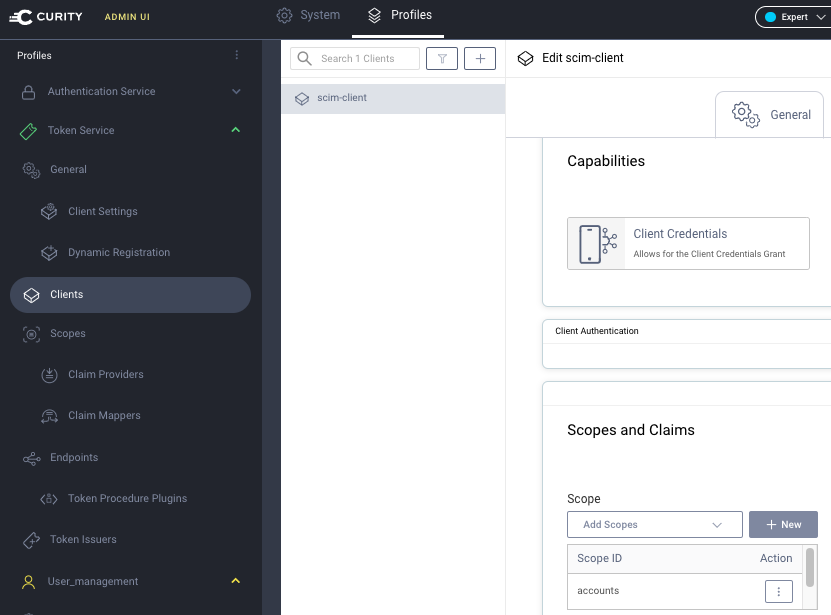

# Authorization Server Deployment

This example deploys an instance of the free edition of the Curity Identity Server.\
Also download a `license.json` file from the [Curity Developer Portal](https://developer.curity.io/community-edition).

## Deploy the Authorization Server

Run the following commands to deploy a Docker based authorization server:

```bash
cd deployment
docker pull curity.azurecr.io/curity/idsvr
docker compose --project-name scim up
```

## Do the Initial Setup

Login to the admin UI at `https://localhost:6749/admin` and ignore certificate warnings due to the self-signed SSL certificate.\
Login with user `admin` and the password from the docker compose file.\
Run the basic setup wizard, select `All options`, provide the license file and accept all other defaults.


Then select the `Changes / Commit` menu option, after which the authorization server is readty to use.\
View the [OpenID Connect Metadata](http://localhost:8443/oauth/v2/oauth-anonymous/.well-known/openid-configuration), to get information about the authorization server, like OAuth endpoints.

## Configure SCIM and a SCIM Client

Next, use the `Changes / Upload` menu to merge the `configuration.xml` file, which enables user management endpoints.\
Select the `Changes / Commit` option, after which the system is fully configured.\
The XML file can be studied to understand the configuration:

- A scope called `accounts` is created
- The SCIM endpoint is configured to require this scope
- An OAuth client is registered that uses this scope and the client credentials flow


